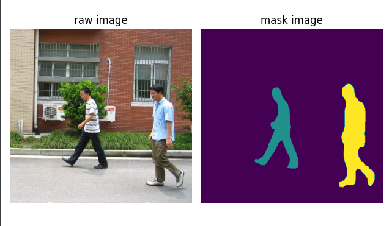

# Pytorch-Learning-Advance
pytorch learning advance


## Dataset
* [Penn-Fudan](https://www.cis.upenn.edu/~jshi/ped_html/)

## Project List
### Basic
* [regression](https://github.com/alexchungio/Pytorch-Learning-Advance/blob/master/Grammar/regression.py)
* [classification](https://github.com/alexchungio/Pytorch-Learning-Advance/blob/master/Grammar/classification.py)
* [mlp](https://github.com/alexchungio/Pytorch-Learning-Advance/blob/master/Grammar/mlp.py)
* [under-fitting vs over-fitting](https://github.com/alexchungio/Pytorch-Learning-Advance/blob/master/Grammar/under_over_fitting.ipynb)
* [weight decay](https://github.com/alexchungio/Pytorch-Learning-Advance/blob/master/Grammar/weight_decay.ipynb)
* [dropout](https://github.com/alexchungio/Pytorch-Learning-Advance/blob/master/Grammar/dropout.ipynb)
* [parameter-operation](https://github.com/alexchungio/Pytorch-Learning-Advance/blob/master/Grammar/parameters.ipynb)
* [custom-layer](https://github.com/alexchungio/Pytorch-Learning-Advance/blob/master/Grammar/custom_layer.ipynb)

### CNN
* [conv2d](https://github.com/alexchungio/Pytorch-Learning-Advance/blob/master/Grammar/conv2d.ipynb)
* [conv2d-utils](https://github.com/alexchungio/Pytorch-Learning-Advance/blob/master/Grammar/conv2d_utils.ipynb)
* [batch-norm](https://github.com/alexchungio/Pytorch-Learning-Advance/blob/master/Grammar/batch_norm.ipynb)
* [ResNet](https://github.com/alexchungio/Pytorch-Learning-Advance/blob/master/Grammar/ResNet.ipynb)

### RNN
* [LM-Dataset](https://github.com/alexchungio/Pytorch-Learning-Advance/blob/master/Grammar/language_model_dataset.ipynb)
* [RNN](https://github.com/alexchungio/Pytorch-Learning-Advance/blob/master/Grammar/RNN.ipynb)
* [LSTM](https://github.com/alexchungio/Pytorch-Learning-Advance/blob/master/Grammar/LSTM.ipynb)
* [GRU](https://github.com/alexchungio/Pytorch-Learning-Advance/blob/master/Grammar/GRU.ipynb)

### Visualize
* [visdom](https://github.com/alexchungio/Pytorch-Learning-Advance/blob/master/Grammar/visdom_mnist.py)
* [tensorboard](https://github.com/alexchungio/Pytorch-Learning-Advance/blob/master/Grammar/tensorboard_cifar10.py)

### Pedestrain detect
* [train](https://github.com/alexchungio/Pytorch-Learning-Advance/blob/master/pedestrian_detection/train.py)
* [inference](https://github.com/alexchungio/Pytorch-Learning-Advance/blob/master/pedestrian_detection/inference.py)



### Sentiment analysis with IMDB 
* [Bi-LSTM](https://github.com/alexchungio/Pytorch-Learning-Advance/blob/master/sentiment_analysis/bidirected_lstm.py)
* [Transformer](https://github.com/alexchungio/Pytorch-Learning-Advance/blob/master/sentiment_analysis/gru_with_transformer.py)
```shell script
0/10
train => acc 0.90625 loss 0.24701716005802155: 100%|██████████| 547/547 [10:58<00:00,  1.20s/it]
eval => acc 0.5833333730697632 loss 0.6128256320953369: 100%|██████████| 235/235 [01:57<00:00,  2.01it/s]
Train => acc 0.828, loss 0.374822
Eval => acc 0.913, loss 0.222050
1/10
train => acc 0.9375 loss 0.14532330632209778: 100%|██████████| 547/547 [11:00<00:00,  1.21s/it]
eval => acc 0.75 loss 0.5595144033432007: 100%|██████████| 235/235 [01:57<00:00,  2.01it/s]
Train => acc 0.899, loss 0.254206
Eval => acc 0.920, loss 0.208731
2/10
train => acc 0.875 loss 0.3833366334438324: 100%|██████████| 547/547 [11:05<00:00,  1.22s/it]
eval => acc 0.75 loss 0.6409324407577515: 100%|██████████| 235/235 [01:57<00:00,  2.00it/s]
Train => acc 0.913, loss 0.220971
Eval => acc 0.907, loss 0.233190
3/10
train => acc 0.9375 loss 0.19367066025733948: 100%|██████████| 547/547 [11:08<00:00,  1.22s/it]
eval => acc 0.6666666865348816 loss 0.6752238273620605: 100%|██████████| 235/235 [02:00<00:00,  1.95it/s]
Train => acc 0.926, loss 0.190243
Eval => acc 0.906, loss 0.248409
4/10
train => acc 0.90625 loss 0.2818787395954132: 100%|██████████| 547/547 [11:20<00:00,  1.24s/it]
eval => acc 0.8333333730697632 loss 0.4631738066673279: 100%|██████████| 235/235 [01:53<00:00,  2.06it/s]
Train => acc 0.939, loss 0.160521
Eval => acc 0.921, loss 0.246075
5/10
train => acc 1.0 loss 0.022274263203144073: 100%|██████████| 547/547 [10:49<00:00,  1.19s/it]
eval => acc 0.9166666865348816 loss 0.5630131959915161: 100%|██████████| 235/235 [01:54<00:00,  2.05it/s]
Train => acc 0.966, loss 0.098212
Eval => acc 0.925, loss 0.235495
6/10
train => acc 0.96875 loss 0.06689105927944183: 100%|██████████| 547/547 [10:45<00:00,  1.18s/it]
eval => acc 0.8125 loss 0.6008918881416321: 100%|█████████▉| 234/235 [01:52<00:01,  1.03s/it]Train => acc 0.974, loss 0.079599
Eval => acc 0.923, loss 0.242368
eval => acc 0.8333333730697632 loss 0.5904927253723145: 100%|██████████| 235/235 [01:53<00:00,  2.08it/s]
7/10
train => acc 1.0 loss 0.03555920720100403: 100%|██████████| 547/547 [10:35<00:00,  1.16s/it]
eval => acc 0.8125 loss 0.6746452450752258: 100%|█████████▉| 234/235 [01:52<00:01,  1.02s/it]Train => acc 0.976, loss 0.070190
Eval => acc 0.925, loss 0.258770
eval => acc 0.8333333730697632 loss 0.6530690789222717: 100%|██████████| 235/235 [01:52<00:00,  2.08it/s]
8/10
train => acc 1.0 loss 0.005548129789531231: 100%|██████████| 547/547 [10:34<00:00,  1.16s/it]
eval => acc 0.8333333730697632 loss 0.651272177696228: 100%|██████████| 235/235 [01:52<00:00,  2.09it/s]
Train => acc 0.980, loss 0.062083
Eval => acc 0.923, loss 0.273925
9/10
train => acc 1.0 loss 0.0062074302695691586: 100%|██████████| 547/547 [10:34<00:00,  1.16s/it]
eval => acc 0.8333333730697632 loss 0.8169242739677429: 100%|██████████| 235/235 [01:52<00:00,  2.09it/s]
Train => acc 0.982, loss 0.057098
Eval => acc 0.925, loss 0.276691
eval => acc 0.90625 loss 0.2808777987957001: 100%|█████████▉| 781/782 [13:15<00:00,  1.02it/s]Test => acc 0.269, loss 0.920836
eval => acc 0.96875 loss 0.14810435473918915: 100%|██████████| 782/782 [13:16<00:00,  1.02s/it]
```
### mmdetection
* [mmdet-demo](https://github.com/alexchungio/Pytorch-Learning-Advance/blob/master/open_mmlab/mmdet_demo.py)

### Apex
```shell script
  git clone https://github.com/NVIDIA/apex.git
  cd apex
  python setup.py install -v --cpp_ext --cuda_ext
```
### warmup 

* [warmup](https://github.com/alexchungio/Pytorch-Learning-Advance/blob/master/Grammar/optimizer_warmup.py)

## TODO

## Reference
* <https://github.com/ShusenTang/Dive-into-DL-PyTorch>